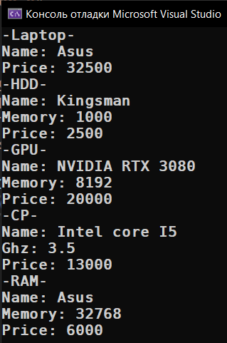

# Practice_17.12.2022_this

* [main folder](main)

* [main.cpp](main/main.cpp)
* [Hdd.cpp](main/Hdd.cpp)
* [GPU.cpp](main/GPU.cpp)
* [CP.cpp](main/CP.cpp)
* [RAM.cpp](main/RAM.cpp)

    <h2>Main</h2>
    

    

